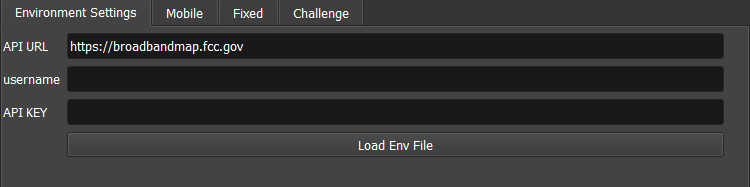
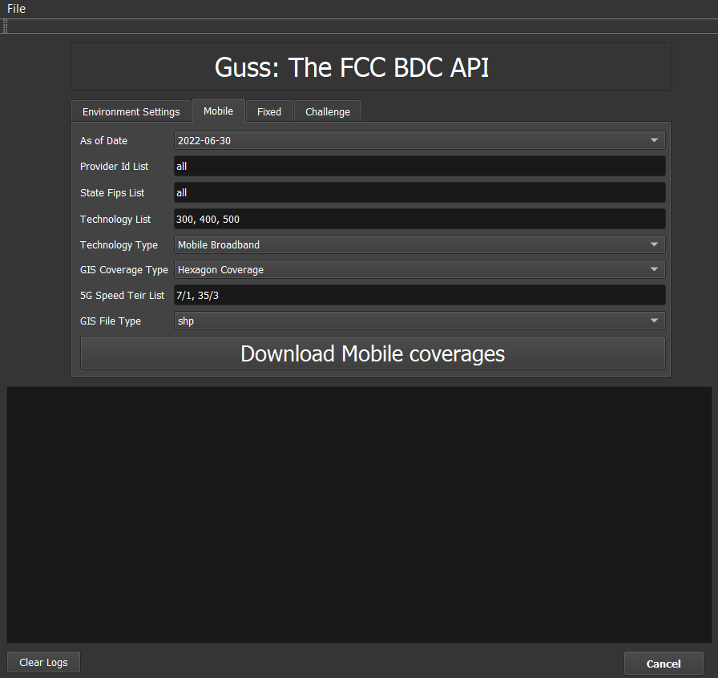
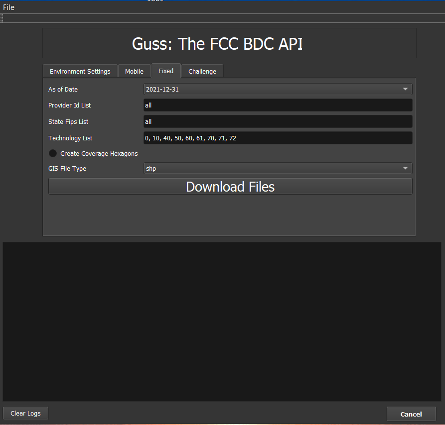
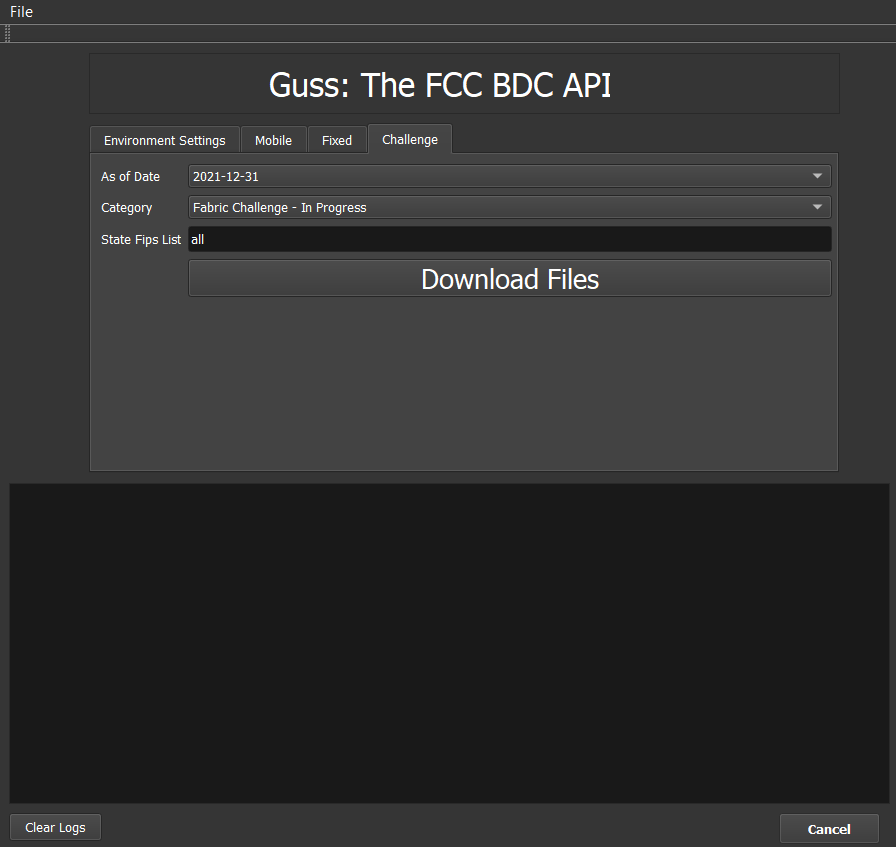

# Guss The FCC BDC Data Downloader
___
This Python package provides an easy-to-use graphical interface for interacting with the Federal 
Communications Commission (FCC) Broadband Data Collection (BDC) API. It allows users to
programmatically download fixed and mobile broadband service coverage data, including availability, speeds,
providers, and other relevant information for various states in the United States.
___
## Features

- Retrieve broadband availability data
- Access broadband service details by state
- Query broadband speeds, technologies, and providers
- Fetch data as GIS geopackage or SHP format
- Easy-to-use functions to interact with the FCC's BDC API

## Requirements

- python 3.6 or higher
- requests==2.32.5 
- pandas==2.3.3
- geopandas==1.0.1
- h3==4.4.1
- pyogrio==0.11.1
- pandas==2.3.3
- python-dotenv==1.2.1

For full list of libraries please see requirements.txt file
___
## Installation

### 1. Download Guss
Pull Guss repository or download and extract the zip folder to your desired project directory

### 2. Create a Virtual Environment
Navigate to your project directory in your terminal. Then, run the following command to create a new virtual environment:

```
python -m venv venv
```
- venv is the name of the virtual environment folder. You can replace it with any name you prefer, but venv is commonly used.
- This command will create a folder called venv in your project directory containing the Python environment.

### 3. Activate the Virtual Environment
After creating the virtual environment, you need to activate it:

#### On macOS/Linux:
```
source venv/bin/activate
```
#### On Windows:
```
venv\Scripts\activate
```
Once activated, you’ll notice the environment name (e.g., (venv)) appears in the terminal prompt, indicating that the virtual environment is active.

### 4. Install Dependencies from requirements.txt
Now, with the virtual environment activated, you can install the required dependencies listed in your requirements.txt file.

Ensure that you have a requirements.txt file in your project folder, and that it contains the necessary dependencies

To install the dependencies, run:

```
pip install -r requirements.txt
```
___
## Usage

### Get Your Credentials
To get your API credentials please visit: https://bdc.fcc.gov/ register to create an account to get your
username and hash code (api key) which you can copy and paste in the environment tab.

#####**Optional**
> create a .env file in the project root directory
In the root directory of your project, create a new file named .env file. 
> This .env file will store your credentials and configuration settings, such as the API credentials and base URL.

###### Add the following content to the .env file:

```
credentials = {'USERNAME':'your.email@domain.com', 'HASH_VALUE':'your registerd api key'}
BASE_URL = 'https://broadbandmap.fcc.gov'
```
---

### Running `main.py` in VSCode Interpreter

Follow these steps to run a `main.py` Python file using the Visual Studio Code (VSCode) interpreter or any python 
interpreter of you choice. Example below is for Vscode only

#### 1. **Open VSCode**

Launch Visual Studio Code.

---

#### 2. **Install the Python Extension for VSCode**

If you haven't already installed the Python extension, follow these steps:

1. In the Activity Bar on the left side of the window, click on the **Extensions** icon (or press `Ctrl+Shift+X`).
2. In the search box, type **Python**.
3. Click the **Install** button for the extension provided by Microsoft.
   
---

#### 3. **Open Your Project Folder**

To open your project folder in VSCode:

1. Click on **File** in the top menu.
2. Select **Open Folder...**.
3. Navigate to the folder where your `main.py` file is located and select it.

---

#### 4. **Select the Python Interpreter**

1. Press `Ctrl+Shift+P` (or `Cmd+Shift+P` on macOS) to open the Command Palette.
2. Type **Python: Select Interpreter** and select it.
3. Choose the Python interpreter you want to use (make sure it’s the one where your dependencies are installed,
   such as your virtual environment or global Python installation).

---

#### 5. **Open `main.py`**

1. In the **Explorer** pane on the left side of VSCode, navigate to the folder where your `main.py` file is located.
2. Click on the `main.py` file to open it in the editor.
3. Make adjustments to the query parameters

---

#### 6. **Run the `main.py` File**

You have several options to run your Python file:

##### Option 1: Using the Play Button to Launch the App

1. After opening `main.py`, you should see a **Run** icon (a green triangle) in the top-right corner of the VSCode editor.
2. Click the **Run** button to execute the script. The output will be shown in the **Terminal** section at the bottom.

##### Option 2: Using the Integrated Terminal to Launch the App

1. Open the integrated terminal in VSCode by clicking **Terminal** in the top menu and selecting **New Terminal**,
   or press `` Ctrl + ` `` (backtick).
2. In the terminal, type the following command:

   ```bash
   python main.py


The app accepts various parameters to customize the query, enabling flexibility and control over the data retrieved.

#### 7. **Load `Environment` Settings Tab**
- Provide your Username and API Key or load them from an `.env` file.

- Without loading the environment users will be prompt to provider username and api key


#### 8. **Optional: Set `Output` Folder**
- Select where processed data and GIS files should be saved.

#### 9. **Workflows**

  - **Mobile**: Download mobile broadband availability.
    
  - **Fixed**: Download fixed broadband availability (with optional polygonization of the Hex).
    
  - **Challenge**: Download challenge-related datasets.



### Detailed Information on the Parameters


- **`As of Date`**: `Dropdown`
  - **Description**: A required date parameter that specifies the reference date for the data in `YYYY-MM-DD` format.
  - **Example**: `"2024-12-01"`


- **`Provider Id List`**: `comma seperated string`
  - **Description**: A list of unique identifiers for the service provider(s) you wish to query.
  - If querying all providers, use `"all"` to select all/any providers.
  - **Example**: `130077, 130403` or `"all"`
  

- **`State Fips List`**: `comma seperated string`
  - **Description**: A list of 2-digit FIPS codes for the states or territories you want to include in the query. The FIPS code should be included with a leading zero. 
  - **Options**:
    - If querying specific states/territories, provide the list of FIPS codes (e.g., `"01", "06"` for Alabama and California).
    - If querying all FIPS codes, use `"all"` to select all states/territories.
  - **Example**: `"01", "06"` or `"all"`


- **`Technology List`**: `comma seperated string`
  - **Description**: A list of technology codes used by the service provider to report service availability. Each code corresponds to a specific technology.
  - **Options**:
    - `300`: 3G
    - `400`: LTE
    - `500`: 5G-NR
  - **Example**: `300, 400, 500`


- **`Technology Type`**: `Dropdown`
  - **Description**: The type of technology being queried. The available options are:
    - `'Mobile Broadband'`
    - `'Mobile Voice'`
  - **Example**: `"Mobile Broadband"`


- **`GIS Coverage Type`**: `Dropdown`
  - **Description**: A drop down choice to specify how to represent a coverage data. Valid options are:
    - `'Hexagon Coverage'`
    - `'Raw Coverage'`
  - **Example**: `"Hexagon Coverage"`


- **`FiveG Speed Tier List`**: `comma seperated string`
  - **Description**: A list of **5G** speed tiers. The format is `"download_speed/upload_speed"`.
    Valid options are:
    - `"35/3"`: 35 mbps download / 3 mbps upload.
    - `"7/1"`: 7 mbps download / 1 mbps upload.
  - **Example**: `"35/3", "7/1"`


- **`GIS Type`**: `Dropdown`
  - **Description**: The type of GIS file format in which the data should be returned.
    Valid options are:
    - `"SHP"`: Shapefile format.
    - `"GPKG"`: GeoPackage format.
  - **Example**: `"shp"` or `"gpkg"`
  

- **`polygonize`**: `Check Button`
  - **Description**: A boolean flag that indicates whether the function should create geometry based on H3 hex id.
    - `checked`: Create geometry based on H3 hex id.
    - `unchecked`: Do not create geometry based on H3 hex id. Output will be a CSV file
  - **Example**: `checked button`
  
---